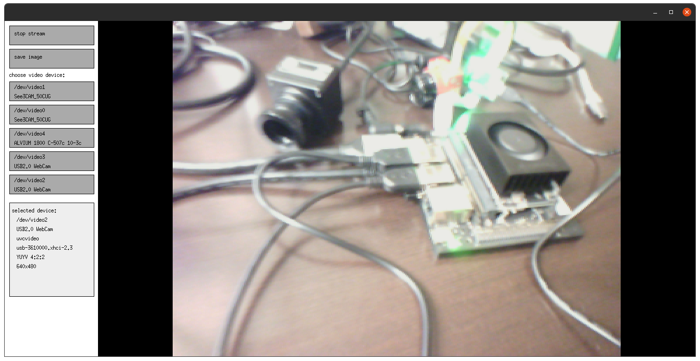

# Webcam Live Viewer

## Dependencies
```bash
sudo apt install gpiod
sudo apt install libgpiod-dev
```

## Features

* Live veiw cameras that support the video4linux2 API 
* Select from multiple cameras
* Zoom in on the mouse position with the mouse wheel
* Click and drag to pan
* Play/pause the live stream
* Take a picture (saved as img.bmp in current directory)

## Limitations

* Only works with cameras that can stream in YUV pixel format
* Doesn't allow you to set camera parameters like resolution and exposure time
* Only works on Linux

## Implementation

### GUI

The app is written with X11 C API for maximum compatibility. 
Theoritically, the app could be used on a remote machine over an ssh connection.
OpenGL is used for drawing the frame because x11 natively only supports bit blits
which are not sufficient for panning and zooming efficiently. 

### Camera Communication

The video4linux2 API is used to communicate with the cameras. 
First we find all drivers mounted in the file system whoes path matches is /dev/video*. 
When the user selects a device, we open it and pick a compatible pixel format (YUV) that it supports.
Then we allocate and enqueue a buffer to store the frame.
Inside the main loop, we dequeue the buffer, convert it to RGB, display it, then re-enqueue it.


